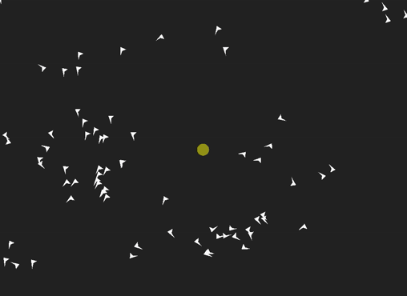

# [View on CodePen](https://codepen.io/alexander-io/pen/ZVYJRp?editors=0011 "Animation on CodePen")

node -v  
npm -v  
git clone https://github.com/alexander-io/Flocking-Algorithms-PixiJS.git  
cd Flocking-Algorithms-PixiJS/  
npm install  
node server.js  
// navigate browser to localhost:8080

